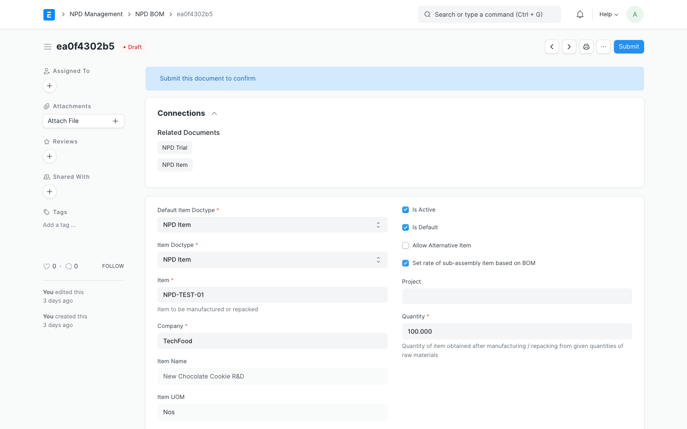

# NPD BOM (Bill of Materials) Management

An `NPD BOM` represents the experimental recipe or formulation structure for a product under development. It allows you to model ingredients, manufacturing operations, and scrap materials in a sandbox, simulating final production costs before committing recipes to your standard BOM catalog.

---

## 1. NPD BOM Form & Layout

Below is the layout of the **NPD BOM** interface:

The form is structured into key R&D formulation sections:
- **Header:** Experimental code, target NPD Item to manufacture, and quantity.
- **Items (Ingredients Table):** A listing of raw materials (either standard Items or other sandbox NPD Items).
- **Operations:** Manufacturing or lab processing steps (mixing, baking, packing).
- **Scrap Items:** Byproducts or waste generated during the trial.

---

## 2. Creating an Experimental Formulation

### Step-by-Step Instructions:

1. Navigate to **NPD BOM** and click **Add NPD BOM**.
2. Select the target **NPD Item** you wish to formulate.
3. In the **Items** table, add the required ingredients. For each row:
   - Select either a standard **Item** (for stock ingredients) or an **NPD Item** (for intermediate experimental mixtures).
   - Enter the target quantity and unit of measure.
   - The system retrieves the estimated cost based on the standard price list or R&D supplier quotations.
4. Under the **Operations** table, define processing steps:
   - Add operations (e.g. `Lab Mixing`, `Pilot Retort`).
   - Specify workstation, operating duration, and operation cost rates.
5. Save and submit the draft.

---

## 3. Sandbox Costing Matrix

The R&D Sandbox dynamically calculates the estimated cost of the formulation in real time:

$$\text{Total Cost} = \text{Material Cost} + \text{Operation Cost} + \text{Scrap Adjustments}$$

- **Material Cost:** Sum of quantities multiplied by the respective ingredient costs (respecting active sandbox supplier quotations).
- **Operation Cost:** Sum of operation durations multiplied by workstation cost-per-minute rates.
- **Scrap Deduction:** Subtraction of salvaged scrap material value.

This costing evaluation allows formulators to immediately see the financial impact of changing ingredient quantities or substitute materials without altering live product valuation records.

---

## 4. NPD BOM Versioning & Comparison

During development, you may create multiple formulation iterations (e.g., `BOM-EXP-001-V1`, `BOM-EXP-001-V2`).
The **NPD BOM Comparison** utility allows you to select two different R&D formulations and compare:
- Ingredient quantity differences.
- Nutrient composition variances.
- Projected costing differences side-by-side.
