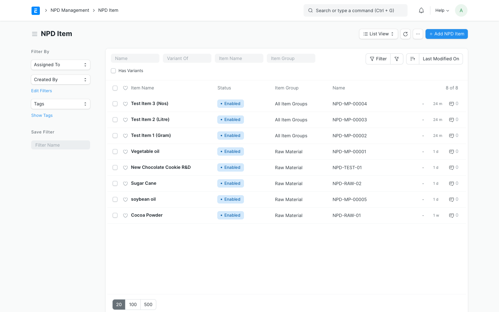
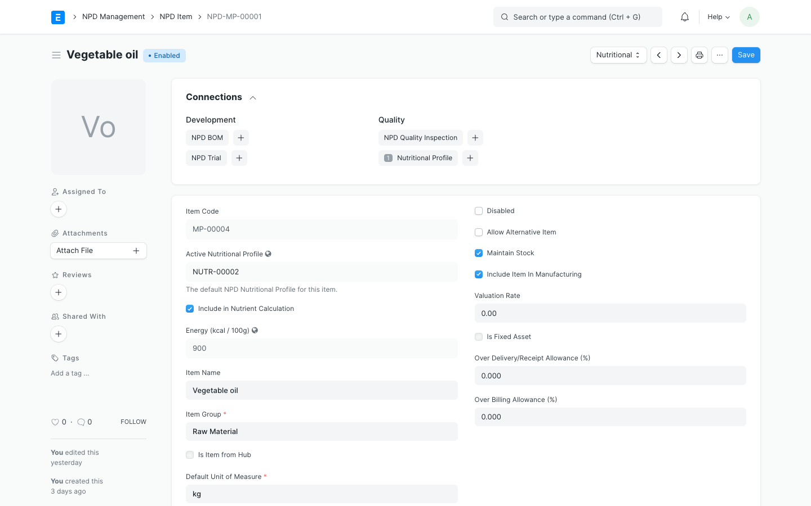

# NPD Item Management

The `NPD Item` doctype is the foundation of the R&D sandbox. It represents raw ingredients, packaging prototypes, or experimental product formulations that are currently in the research phase and must not be listed in standard production inventory search options.

---

## 1. Viewing the NPD Item Catalog

To see all experimental items, navigate to the **NPD Item** list view.

From this screen, you can:
- Filter items by Group, Manufacturer, or Phase.
- Monitor item status (Draft, Under Trial, Approved, Promoted).
- Add new experimental items.

---

## 2. Creating an NPD Item

1. Navigate to **NPD Item** list view and click the **Add NPD Item** button.
2. Fill in the core details:
   - **NPD Item Code:** Unique experimental identifier (e.g. `EXP-FLOUR-001`).
   - **NPD Item Name:** Descriptive name.
   - **NPD Item Group:** Sandbox group (e.g., Raw Materials, Finished Goods).
   - **Default UOM:** Standard stock unit (e.g., Grams).
3. Under the **Aesthetics & Properties** section, define sensory characteristics (Color, Aroma, State) if applicable.
4. Save the document.

> [!NOTE]
> Custom fields configured on the standard `Item` doctype will also render here automatically to ensure structural parity, allowing you to fill in vendor names, internal codes, or manufacturing specifications.

---

## 3. Promoting an NPD Item to a Standard Production Item

Once an experimental item is validated (passed trial phases, sensory tests, and cost targets), you can promote it directly to the live ERPNext production inventory.

### Step-by-Step Instructions:

1. Open the approved **NPD Item** document.
2. Ensure the status is set to **Approved** or the item has met R&D approval criteria.
3. Click the **Promote to Standard Item** action button at the top-right of the form.
4. An interactive dialog will prompt you to select:
   - The target naming series (if using auto-naming for standard items).
   - Confirmation of fields to transfer.
5. Click **Confirm**. The application will:
   - Generate a new standard ERPNext **Item** document.
   - Map all custom fields, properties, conversion rates, and the nutritional profile from the `NPD Item` to the new `Item`.
   - Update the status of the `NPD Item` to **Promoted**.
   - Save a permanent reference of the new standard Item Code in the `NPD Item` record for audit trail purposes.

> [!IMPORTANT]
> Once promoted, the new Item is active in the production database and can be selected in standard purchase orders, production BOMs, and sales cycles. The source `NPD Item` remains in the system as a historical R&D record but is locked from further edits.
