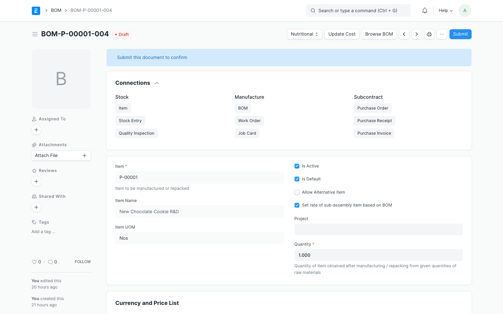

# Nutritional Profile & BOM Rollup

In food manufacturing, formulating a recipe requires tracking raw nutrient density (e.g. Sodium, Dietary Fiber, Fats, Sugars) and rolling up these values to calculate the nutritional profile of the finished product. The `npd_management` module automates this calculation in a sandbox environment.

---

## 1. Setting up a Nutritional Profile

A `Nutritional Profile` defines the nutrient concentration of an ingredient or finished product per **100g** or **1Kg** reference weight.

### Step-by-Step Instructions:

1. Navigate to **Nutritional Profile** list view and click **Add Nutritional Profile**.
2. Select the target **Item** or **NPD Item**.
3. Under the nutrients table, define the values:
   - **Sodio (Sodium):** Value in mg or g.
   - **Fibra Dietética (Dietary Fiber):** Value in g.
   - *(Note: Additional fields like Proteins, Carbohydrates, and Fats will render depending on your schema customizations).*
4. Save the document.

---

## 2. Kg UOM Conversions (Critical for Rollup)

Because ingredients are measured in various units (e.g., grams, kilograms, liters, ounces), the nutritional rollup engine must convert all quantities to a **Kilogram (Kg)** weight basis to run accurate density calculations.

### Setting up the UOM Conversion Factor:

1. Open the target **Item** or **NPD Item** document.
2. In the **UOMs** child table, ensure there is a conversion row for the unit `Kg`.
3. Set the **Conversion Factor** according to standard ERPNext convention:
   
   $$\text{1 Stock UOM} = \text{Conversion Factor} \times \text{Kg UOM}$$

   - **Example 1:** If the Stock UOM is `g` (Grams), 1 g = 0.001 Kg. Therefore, the conversion factor is `0.001`.
   - **Example 2:** If the Stock UOM is `Kg`, the conversion factor is `1.0`.
   - **Example 3:** If the Stock UOM is `lb` (Pounds), 1 lb = 0.453592 Kg. Therefore, the conversion factor is `0.453592`.

> [!WARNING]
> If an ingredient does not have a `Kg` UOM conversion factor defined, or if the factor is less than or equal to 0, the nutritional engine will not include this ingredient in the rollup, and a validation warning will appear on save.

---

## 3. Running the Nutritional Rollup on a BOM

When you compile or update an `NPD BOM` or standard `BOM`, the module aggregates the individual nutrient densities of all child ingredients.

### The Rollup Calculation Mechanism:

The rollup engine runs the following logic for each nutrient (e.g. Sodium):

1. **Calculate Ingredient Weight in Kg:**
   
   $$\text{Weight (Kg)} = \text{BOM Qty} \times \text{UOM Conversion Factor}$$

2. **Retrieve Nutrient Concentration:** Reads the ingredient's `Nutritional Profile` value (which is defined per 100g of ingredient weight).
3. **Calculate Ingredient Nutrient Contribution:**
   
   $$\text{Contribution} = \text{Weight (Kg)} \times \frac{\text{Nutrient Value per 100g}}{0.1}$$

4. **Aggregate Total Recipe Weight and Total Nutrient Contribution:** Sums these weights and contributions across all recipe lines.
5. **Compute Finished Product Density:** Divides the aggregate nutrient contribution by the total recipe weight to obtain the nutrient value per 100g of the finished product:
   
   $$\text{Finished Nutrient (per 100g)} = \frac{\text{Total Nutrient Contribution}}{\text{Total Recipe Weight (Kg)}} \times 0.1$$

6. **Save to BOM:** The results are saved directly to the BOM's nutritional fields (`sodio`, `fibra_dietetica`, etc.) and displayed in the document header.
